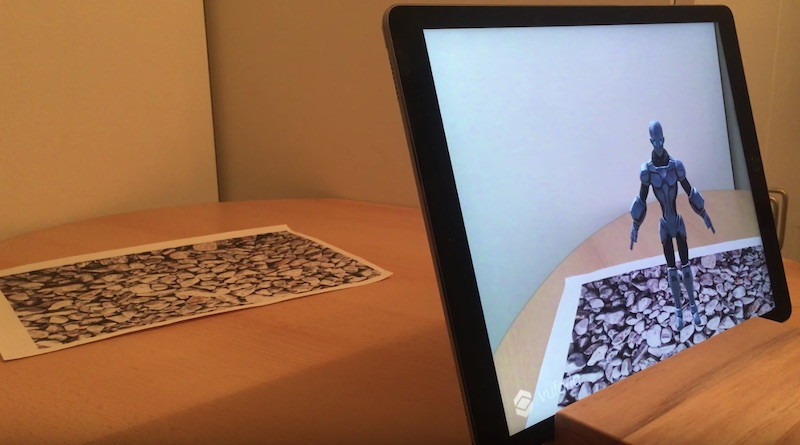

# Augmented Reality Sample using IBM Watson, Unity and Vuforia

This project contains a simple Augmented Reality application which allows users with an iOS device to ask a 3D character, that stands on a piece of paper, for weather information.

Technically the following services and tools are used:

* [Unity](https://unity3d.com/unity)
* [Vuforia](https://developer.vuforia.com/)
* [IBM Watson SDK for Unity](https://github.com/watson-developer-cloud/unity-sdk)
* [IBM Watson Speech To Text](https://www.ibm.com/watson/services/speech-to-text/)
* [IBM Watson Assistant](https://www.ibm.com/watson/services/conversation/)
* [IBM Watson Text To Speech](https://www.ibm.com/watson/services/text-to-speech/)
* [Weather Company Data](https://console.bluemix.net/catalog/services/weather-company-data)

The picture shows a printed paper with a pattern. When using the app the 3D character shows up on the paper. Users can have conversations with the character, for example:

* User: How is the weather?
* Character: In which location?
* User: Munich
* Character: The temperature in Munich is currently 24 degrees.
* User: How is the weather in Berlin?
* Character: The temperature in Berlin is currently 28 degrees.

Check out the [video](https://www.youtube.com/watch?v=u8c0fPQOqMU) for a short demo.

Credit goes to [Amara Keller](https://medium.com/@MissAmaraKay/build-your-first-ai-ar-app-on-unity-8c12895687fa) for creating the initial version of this sample!

### Setup

Amara has written a nice [blog](https://medium.com/@MissAmaraKay/build-your-first-ai-ar-app-on-unity-8c12895687fa) about the setup of this sample. You should follow the exact same instructions with only a few changes as outlined below.

Instead of the orginial SoldierConvo.cs file use [SoldierConvo.cs](SoldierConvo.cs) from this project. Additionally add [MessageResponseExtended.cs](MessageResponseExtended.cs) to your project.

Instead of the orgininal workspace import [workspace.json](workspace.json) into Watson Assistant.

Create an instance of the [Weather Company Data](https://console.bluemix.net/catalog/services/weather-company-data) service. Copy and paste all credentials at the top of the file [SoldierConvo.cs](SoldierConvo.cs).
